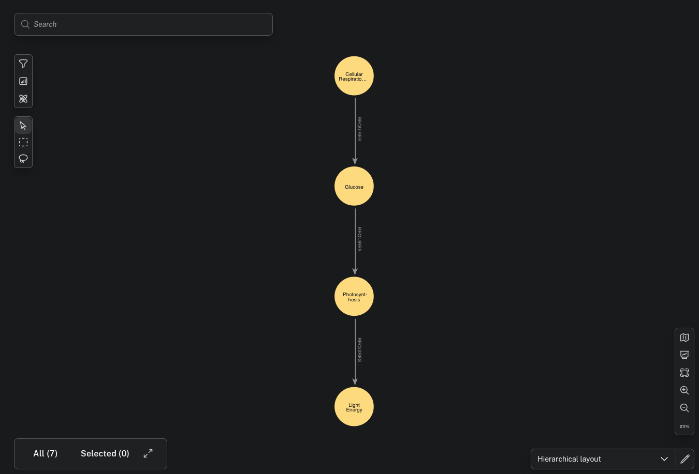
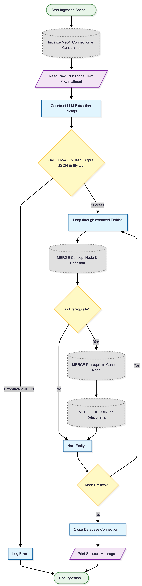
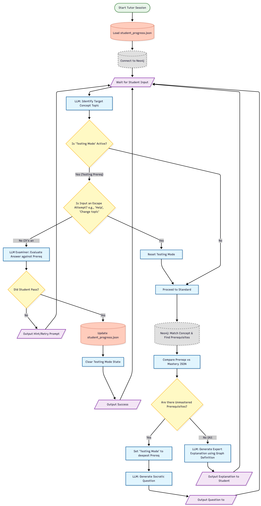

# Socratic Graph Tutor (LMS-AI)

**Project Summary:** A sophisticated Educational AI utilizing a Graph-RAG (Retrieval-Augmented Generation) architecture to deliver non-linear, prerequisite-based learning. By integrating Neo4j with the GLM-4.6V-Flash model, this system enforces academic rigor through Socratic gatekeeping, ensuring students master foundational concepts before progressing to complex biological topics.

---

## Core Concept
The Socratic Graph Tutor addresses the limitation of "AI hand-holding" by acting as a persistent gatekeeper. Using the Kai-org/glm-4.6v-flash model, the system identifies user intent but prevents the explanation of advanced topics until the student demonstrates mastery of the foundational prerequisites stored within the knowledge graph.

---

## Methodology

### 1. The Knowledge Graph (Neo4j)
The system's authoritative knowledge source is a Neo4j graph database. Educational concepts are modeled as nodes, while dependencies are modeled as directed `REQUIRES` relationships.
* **Nodes**: Individual concepts (e.g., Energy, Photosynthesis, Glucose).
* **Edges**: Directed links defining the logical learning path (e.g., Photosynthesis requires foundational knowledge of Energy).

### 2. Knowledge Graph Visualization

**Graph Architecture Explanation:**
The visualization below represents the hierarchical nature of the curriculum. In this schema, nodes at the bottom of the chain represent fundamental scientific principles, while nodes at the top represent complex biological processes. The system performs a recursive search through these relationships to identify the "deepest" unmastered prerequisite. By visualizing these connections, we can observe the critical paths the student must navigate to unlock advanced topics.

### 3. Intent Routing and Gatekeeping
Upon receiving a student query, the system executes a multi-agent logic flow:
1. **Intent Mapping**: The LLM maps the natural language query to the specific concept node in the graph.
2. **Prerequisite Verification**: The system queries Neo4j to identify any unmastered dependencies for that node.
3. **Socratic Evaluation**: If prerequisites are missing, the AI transitions from "Tutor" to "Examiner," issuing targeted questions to verify the student's foundational understanding.

### 4. Persistent Mastery Tracking
Student progress is maintained via a local JSON-based Mastery Profile. This ensures that the learning experience is personalized and non-repetitive across multiple sessions.

---

## Technical Challenges Solved

### 1. Mitigation of the "Modal Logic Trap"
In traditional state-based conversational agents, entering a "Testing Mode" often creates a logic loop where the user is trapped until a correct answer is provided. I implemented Intent-Priority Routing, which allows the system to detect if a student is requesting assistance or attempting to switch topics. This enables the AI to break the testing loop and provide "Scaffolding" (contextual hints) derived from graph-stored definitions.

### 2. LLM Reasoning Sanitization
Modern Chain-of-Thought models frequently output internal reasoning tokens (such as `<think>` tags). I developed a post-processing Regex pipeline that identifies and removes these artifacts in real-time, delivering a clean, professional pedagogical interface to the student.

### 3. Asynchronous Graph-LLM Synchronization
Mapping natural language to a strictly defined Graph Schema often leads to hallucinations. I utilized a two-pass extraction logic: first, identifying valid concepts existing within the database, and second, prompting the LLM to select the most appropriate match from the known entities, ensuring 100% schema alignment.

---

## System Architecture

### Ingest Flowchart

### Tutor Flowchart

* **Extraction Engine**: A specialized script leverages the LLM to parse raw scientific text into structured JSON for Neo4j ingestion.
* **Evaluation Loop**: A secondary LLM prompt configuration acts as a strict academic examiner to provide binary Pass/Fail logic on student responses.

---

## Technical Stack
* **Large Language Model**: Kai-org/glm-4.6v-flash
* **Graph Database**: Neo4j (Cypher Query Language)
* **Programming Language**: Python 3.11.9
* **Persistence Layer**: JSON-based student profiles

---

## Getting Started

### Prerequisites
1. Ensure Neo4j Desktop is active with a running database instance.
2. Configure your local server (e.g., LM Studio) to host the `glm-4.6v-flash` model.

### Installation and Execution
1. **Ingest Data**: Populate the graph by running the ingestion script:
   `python ingest_graph.py`
2. **Launch Application**: Start the tutor session:
   `python tutor.py`

---

## Author

**Jonathon Moore**

> *Building the bridge between Cognitive AI and Embodied Intelligence.*

I am an AI Engineer specializing in the full stack of modern Artificial Intelligence. This project represents the second pillar of my core competencies:

1.  **Evaluation Frameworks:** Quantifying LLM performance.
2.  **Generative Graph-RAG:** Building complex, stateful knowledge systems.
3.  **Embodied Agents (This Project):** Training autonomous decision-making systems in dynamic environments.

---

